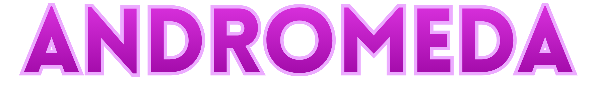

# Andromeda.Mod

Andromeda.Mod is the runtime patch mod that makes Enemy On Board work with the Andromeda ecosystem.

## Features

- Dedicated server support (`--server` / `--dedicated-server`) with debug-friendly startup behavior.
- Network redirect from legacy services to Andromeda infrastructure.
- Cryonaut support re-added (model, progression UI, showcase, and skin alias fixes).
- Built-in debugging tools (`NetworkDebugger`, request capture, verbose logging, log redirect).
- Gameplay/runtime reliability patches (session flow, phase/armory handling, first-person fixes).
- Network safety patches for entity/message routing and startup stability.
- Steam and server compatibility patches for hosted sessions.

## Project Status

Actively undergoing refactor. Some parts are transitional/unclean right now, and some sections were AI-assisted during rapid iteration and are being cleaned up over time.

## Community

[Join Discord](https://discord.gg/fMbrCUKHP8) for releases, support, and testing coordination.
