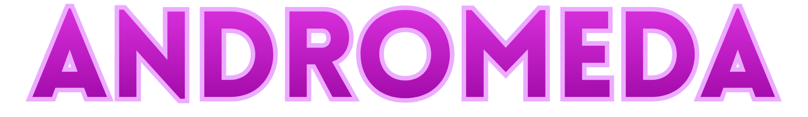

Andromeda.Mod is the runtime gameplay mod for Enemy On Board.

This mod switches from Windwalk servers to the Andromeda servers, as well as multiple other patches that are necessary to make the game work or generally a better experience.

For a server on the same Wi-Fi/LAN when the router cannot loop back its public IP, open **F10 → Settings**, enable **Force local server IP for all joins**, and enter the server computer's private IPv4 address (for example `192.168.1.50`). Use `127.0.0.1` only when the server runs on the same computer as the game. Click **SAVE SETTINGS** to persist it, then join normally. The override takes effect on the next join and preserves the assigned game port and session ID. Invalid addresses leave the original join address in use. Disable the override before joining internet servers. If the API itself is also unreachable through the public IP, set **Python API URL** to its LAN URL separately.

CI/CD secrets:
- ANDROMEDA_GAME_MANAGED_ZIP_URL: required URL to a zip containing Enemy On Board managed DLLs, including Assembly-CSharp.dll (CI generates its publicized reference), or a pre-publicized Assembly-CSharp-Publicized.dll.
- ANDROMEDA_GAME_MANAGED_ZIP_TOKEN: optional bearer token used to access the private URL.

Discord: https://discord.gg/fMbrCUKHP8

Release publishing requires a fresh build from the matching tag. The release workflow checks that the tag, `BuildInfo.Version`, compiled assembly version, and Windows file version agree before uploading the DLL. Manual runs require an existing release tag. Dependency downloads retry transient failures; if the dependency URL remains unavailable, restore `ANDROMEDA_GAME_MANAGED_ZIP_URL` before rerunning. Do not relabel or patch an older DLL to create a new release.
